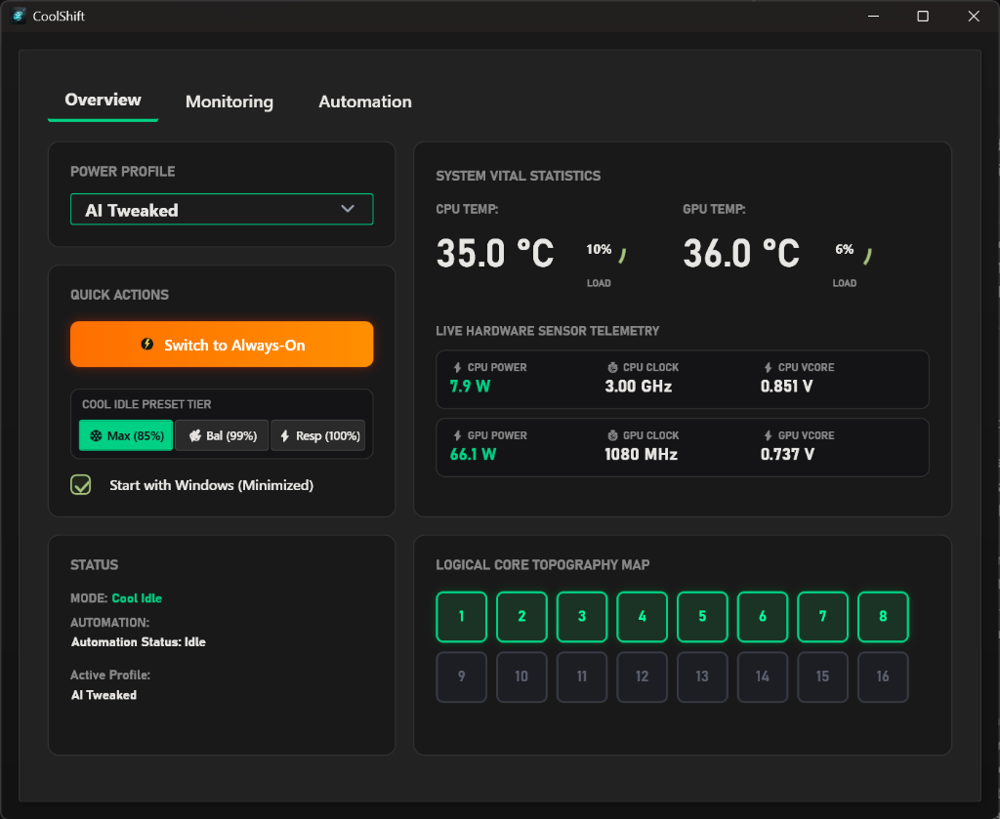

# CoolShift ❄️⚡

**CoolShift** (formerly *Park Toggle*) is a modern, ultra-lightweight Windows desktop utility designed to dynamically manage CPU core parking, processor frequency scaling, power plan states, and live hardware sensor telemetry.

By running silently in your system tray, **CoolShift** automatically shifts your PC between an energy-efficient **Cool Idle** mode (dropping idle CPU package power down to ~8.1W at 35°C) and a high-performance **Always On** mode whenever heavy workloads or games are launched.

<p align="center">
  
</p>

---

## ✨ Key Features

### ⚡ Smart Automation & Auto-Switching
- **Game & Workload Auto-Detection**: Automatically detects active games (Steam, Epic Games, custom EXEs) and shifts into high-performance mode, then seamlessly shifts back to Cool Idle upon exiting.
- **Process Picker**: Easily search and select active running processes to add to your auto-switching trigger list.
- **Smart Battery Override**: Auto-detects AC vs. Battery power transitions to enforce power-saving states on battery.

### ❄️ Cool Idle Tier Presets
- **MaxCool (85% Max CPU)**: Maximum cooling & power efficiency. Configures minimum processor state to 5% (downclocks CPU to ~800MHz at idle), aggressive core parking, and delayed core unparking (`PERFINCTIME` = 5) to ignore brief background micro-spikes. Drops idle CPU power draw down to **~8.1W** at **35°C**!
- **Balanced (99% Max CPU)**: Disables CPU boost clocks for quiet, cool daily computing without thermal throttling.
- **Responsive (100% Max CPU)**: Keeps full boost clock headroom while enabling dynamic idle frequency scaling.

### 📊 6-Tile Live Hardware Telemetry Panel
Real-time hardware monitoring dashboard powered by LibreHardwareMonitor and native MSI Afterburner shared memory integration (`MAHMSharedMemory`):
1. **CPU Power (W)**: Live package power draw.
2. **CPU Clock (MHz / GHz)**: Real-time average clock frequency across all cores.
3. **CPU VCore (V)**: Live CPU core voltage readouts.
4. **GPU Power (W)**: Live GPU board / package power.
5. **GPU Clock (MHz)**: Real-time GPU core clock speed.
6. **GPU VCore (V)**: Direct Ring-0 shared memory intercept from **MSI Afterburner**.

### 📈 Historical Thermal & Load Charting
- **Rolling Temperature History**: Live gradient-filled temperature chart powered by LiveCharts2 (SkiaSharp).
- **Interactive Load Gauges**: Symmetrical dual gauges for CPU and GPU usage.

### 🔔 System Tray & Silent Auto-Start
- **UAC-Free Windows Boot**: Dual-registration engine via Windows Startup Registry (`HKCU\Software\Microsoft\Windows\CurrentVersion\Run`) and Task Scheduler for silent, background startup with `--hidden` flag.
- **Live Tray Tooltip**: Hover over the tray icon for live temperature updates (`CoolShift | CPU: 35.0 °C | GPU: 37.0 °C`).
- **Quick Action Context Menu**: Right-click tray menu for instant access to Windows system tools (Restart Explorer, Open Task Manager, Flush DNS Cache, Empty Recycle Bin, Open Power Options).

---

## 🚀 Getting Started

### System Requirements
- **OS**: Windows 10 (20H1 or newer) / Windows 11 (64-bit)
- **Runtime**: .NET 8.0 Desktop Runtime

### Building from Source

```powershell
# Clone repository
git clone https://github.com/imsystemvsc/Parktoggle.git
cd Parktoggle

# Publish self-contained single-file Release binary
dotnet publish -c Release -r win-x64 --self-contained true -p:PublishSingleFile=true -p:IncludeNativeLibrariesForSelfExtract=true -p:PublishTrimmed=false
```

The compiled single-file binary will be generated in `bin\Release\net8.0-windows\win-x64\publish\CoolShift.exe`.

---

## ⚙️ Usage

1. Launch **`CoolShift.exe`**.
2. Select your preferred **Cool Idle** preset tier (*MaxCool 85%*, *Balanced 99%*, or *Responsive 100%*).
3. Switch to the **Automation** tab to manage trigger processes or add active games via the **Process Picker**.
4. Enable **Start with Windows** for background auto-management.
5. Hover over or right-click the system tray icon for live sensor telemetry and quick action tools.

---

## 🛠️ Built With

- **Framework**: WPF & .NET 8.0 (C#)
- **MVVM Architecture**: `CommunityToolkit.Mvvm`
- **Telemetry Engine**: `LibreHardwareMonitorLib` + Native MSI Afterburner Shared Memory (`MAHMSharedMemory`) Intercept
- **Visualization**: `LiveChartsCore.SkiaSharpView.WPF`
- **System Tray**: `H.NotifyIcon.Wpf`
